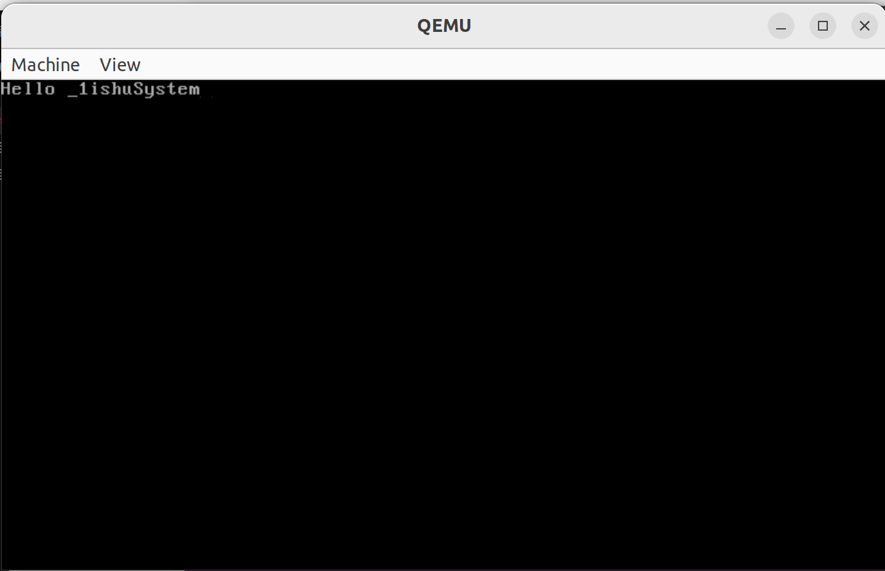

我编辑操作系统第一步：在屏幕上输出`Hello _i1shuSys`

<!-- truncate -->

便携操作系统使用Ubuntu22.04

## 1.编写引导加载程序

首先，创建一个名为 `boot.asm` 的文件，并输入以下内容：

```ASM
org 0x7C00

start:
    mov ah, 0x00
    mov al, 0x03
    int 0x10

    mov ah, 0x02
    mov bh, 0x00
    mov dh, 0x00
    mov dl, 0x00
    int 0x10

    mov si, message
    call print_string

    jmp $

print_string:
    mov ah, 0x0E
.print_char:
    lodsb
    cmp al, 0
    je .done
    int 0x10
    jmp .print_char
.done:
    ret

message db 'Hello _1ishuSystem', 0

times 510-($-$$) db 0
dw 0xAA55
```

## 2.编译引导加载程序

使用 NASM 将 `boot.asm` 编译为二进制文件：

```bash
nasm -f bin boot.asm -o boot.bin
```

## 3.创建虚拟软盘镜像

使用 `dd` 命令创建一个虚拟软盘镜像，并将引导加载程序写入其中：

```bash
dd if=/dev/zero of=1ishufirst.img bs=512 count=2880
dd if=boot.bin of=1ishufirst.img conv=notrunc
```

## 4.使用 QEMU 运行

使用 QEMU 来运行这个虚拟软盘镜像：

```bash
qemu-system-x86_64 -fda 1ishufirst.img
```

## 5. 结果

一切顺利，QEMU 会启动并显示 "Hello _1ishuSystem"。



## 注意

这只是一个非常简单的引导加载程序，它只是打印了一条消息并进入无限循环。接下来，继续开发操作系统内核，添加更多的功能，比如文件系统、内存管理、进程调度等。

- 这个引导加载程序只能在 BIOS 模式下运行，不支持 UEFI
- 这个程序只是一个非常基础的示例