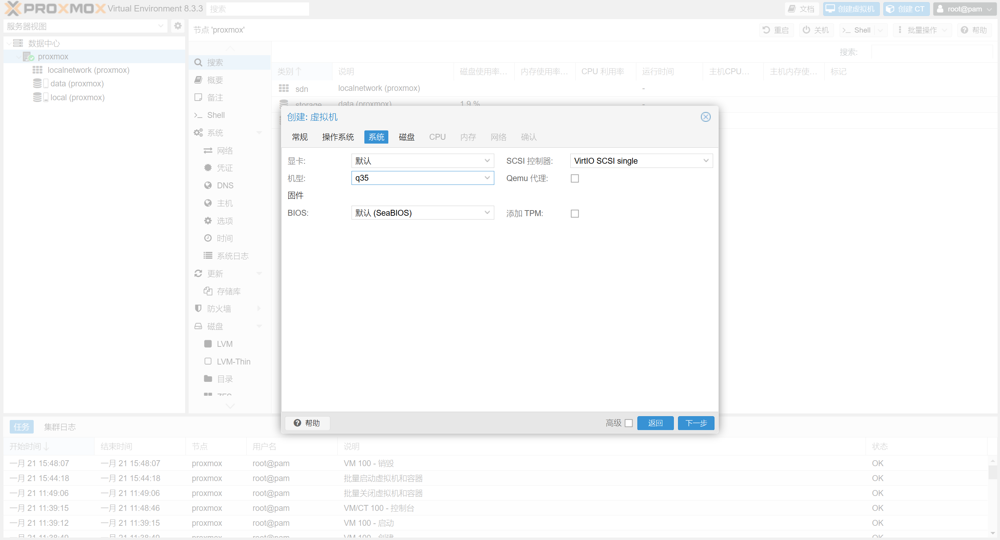
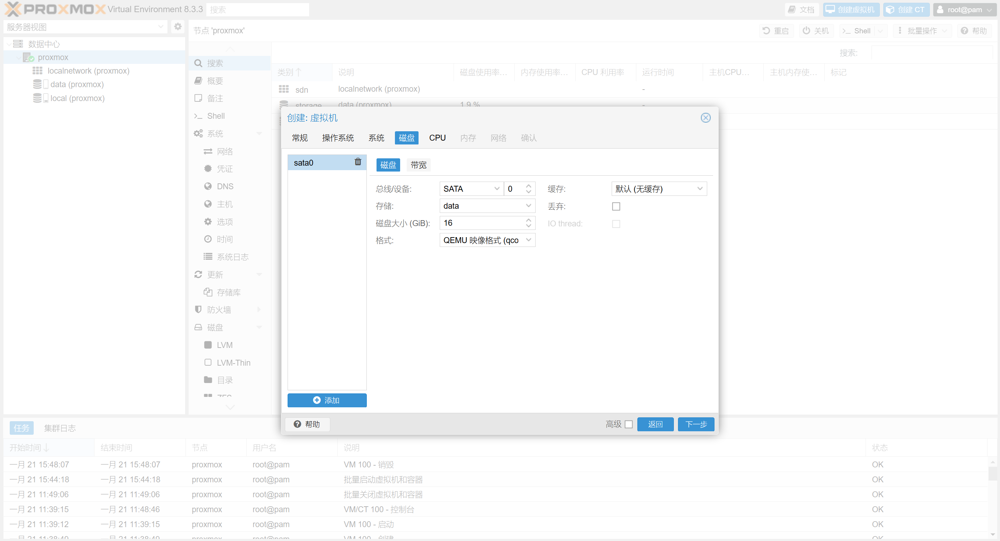
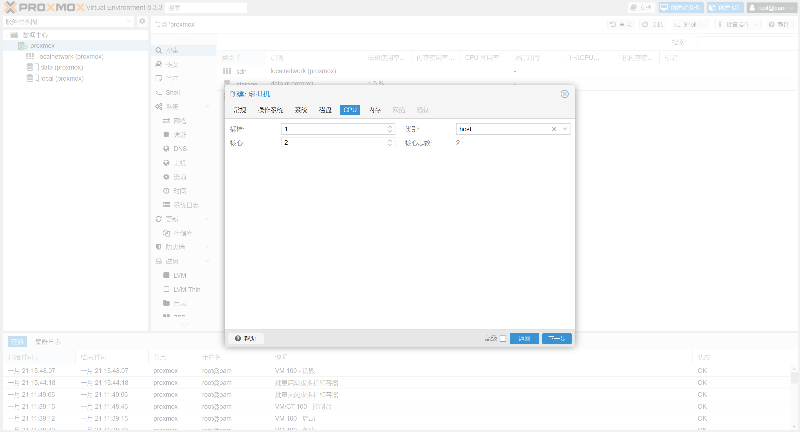
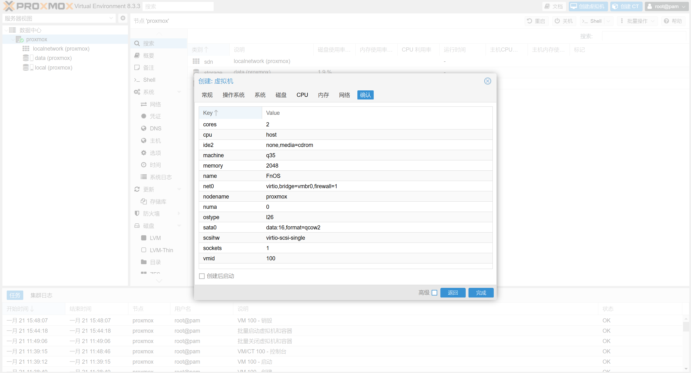
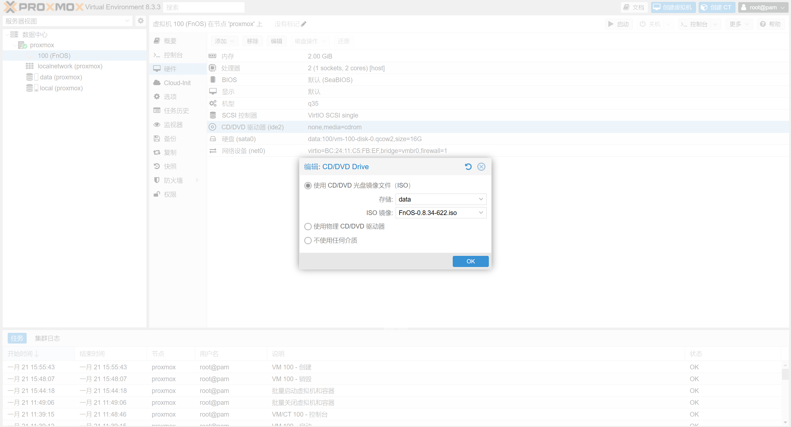
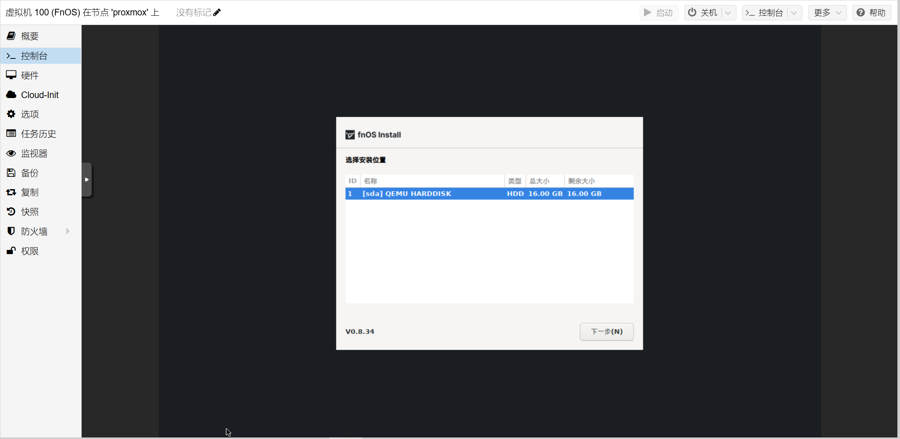
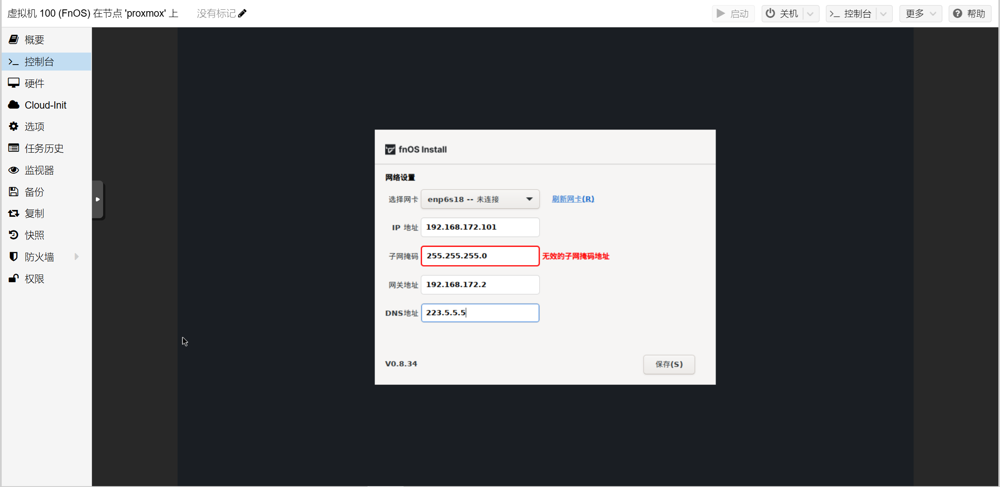
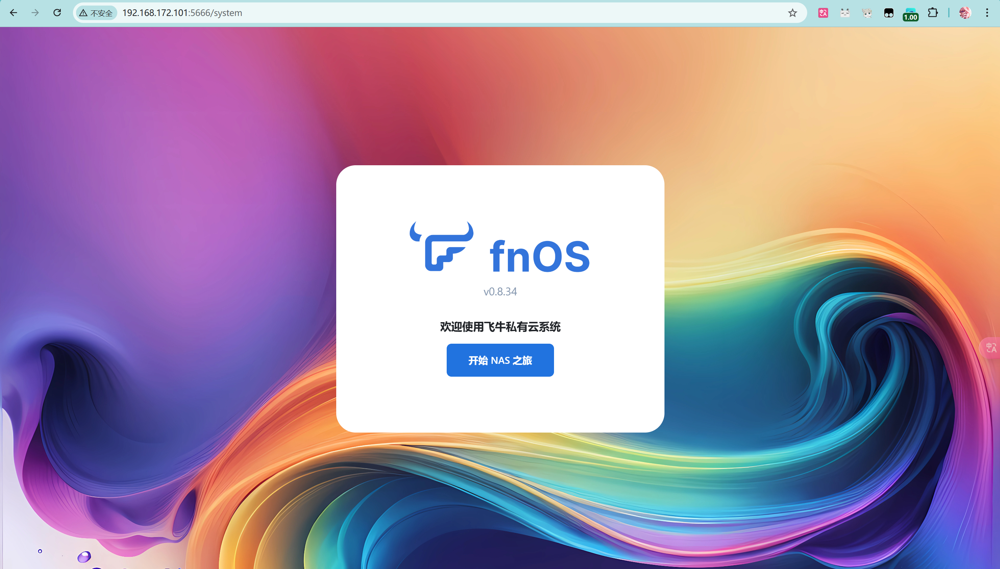

本文章是在ProXmox上安装FnOS作为Nas主系统的文档

<!-- truncate -->

## 1.配置虚拟硬件

选择创建节点，VM ID，虚拟机名称

在选择操作系统的时候选择**不使用任何介质**

在选择系统上，机型选择**q35**其他不需要改变（这里用q35才能正常使用）

磁盘选择为**SATA**总线设备，安装系统的虚拟磁盘只需要**16G**就行

对于CPU来说，我们只需要配置两个核心就行，**类别选择**性能更好

内存默认**2G**就行

网络也无需修改，使用**vmbr0**桥接

确认配置

## 2.安装FnOS

首先上传FnOS镜像到ProXmox上，在**CD/DVD驱动器**上选择FnOS的ISO镜像

在控制台启动虚拟机，按照FnOS的安装流程

选择创建的16G虚拟磁盘

后续操作都是一直下一步

配置网络

输入192.168.172.101进入FnOS网页

输入设备名字和账号密码

现在就会自动进入FnOS的主页

现在没有添加文件存储，需要后续的操作

这个16G的虚拟磁盘仅仅是用于安装系统