这里记录了Nas搭建过程中的主机虚拟化ProXmox搭建

<!-- truncate -->

## 1.配置主机

首先我们找好主机，配置硬件虚拟化（VTX/VTD）功能

这里我给出了VM主机

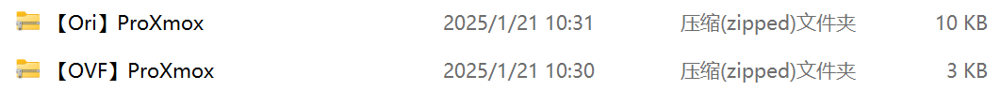

**Ori**为虚拟机直出

**OVF**为虚拟文件导出

## 2.安装ProXmox

这里我们添加两个硬盘

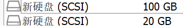

ISO选择ProXmox-8，之后运行主机

按照正常流程安装ProXmox

在安装过程中安装到20G的硬盘中

这里我们主要是要记住密码和IP

密码：proxmox

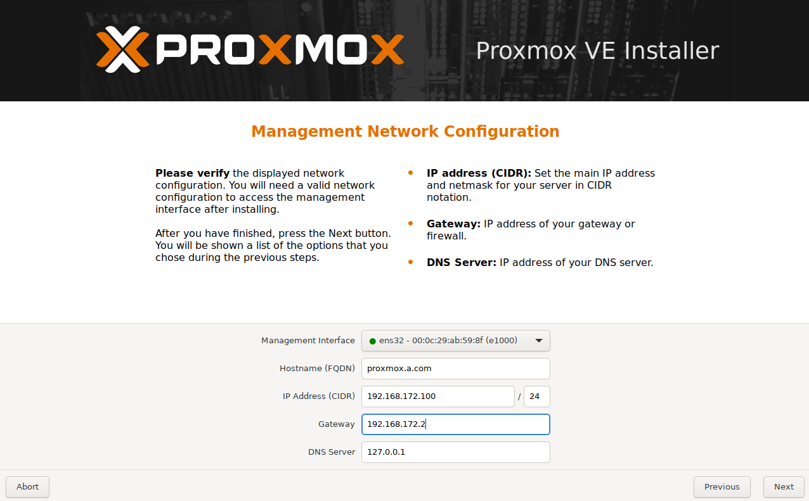

这里面我暂时把`gateway`修改为Nat中的路由，之后会换成主机内部的`iStoreOS`

## 3.登陆网页管理并且优化ProXmox

输入`http://192.168.172.100:8006/`

这里需要选择Linux PAM认证

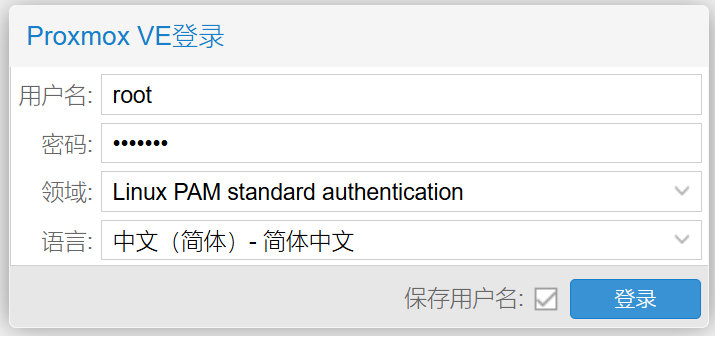

优化一共有几个步骤，首先是取消订阅

第一步需要在主机添加DNS

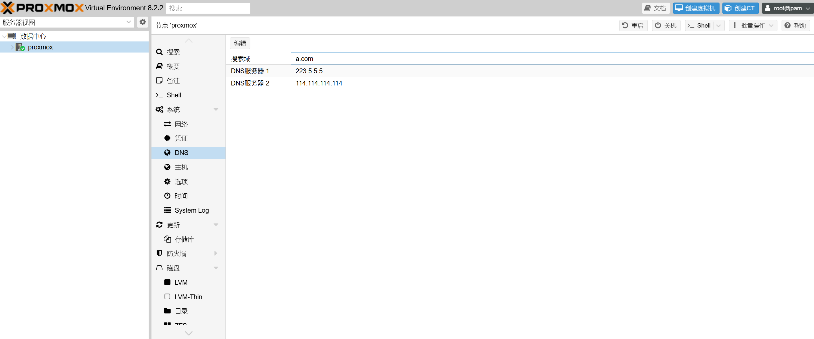

在SSH中登录ProXmox

```bash
wget -q -O /root/pve_source.tar.gz 'https://bbs.x86pi.cn/file/topic/2023-11-28/file/01ac88d7d2b840cb88c15cb5e19d4305b2.gz' && tar zxvf /root/pve_source.tar.gz && /root/./pve_source
```

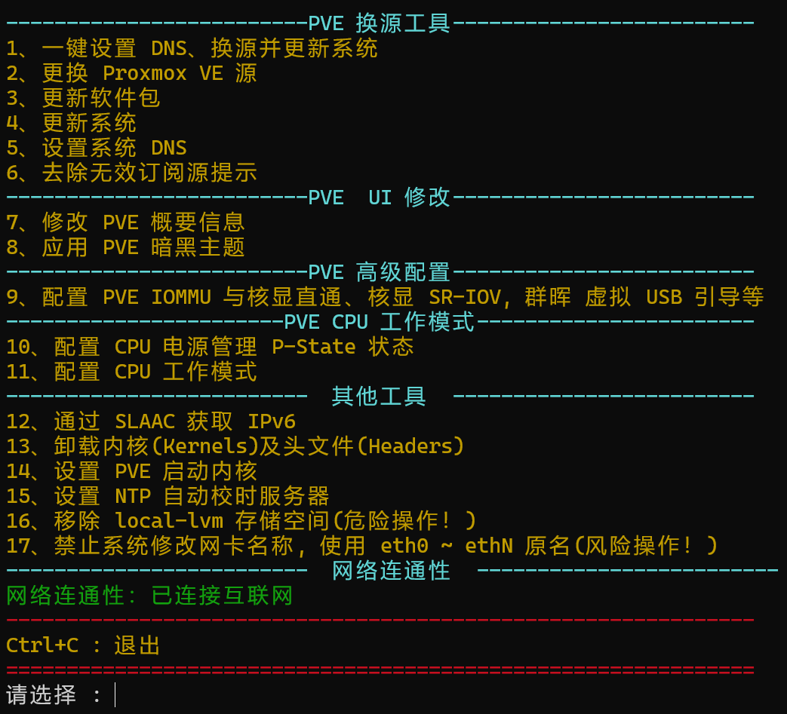

### 更新系统

输入1，y，2开始更新系统

这里一共包含更新DNS、换源、更新系统

### 取消订阅

输入6

### 修改网页概要

输入7，1，o，l开始修改概要，这里o和l是同级的

### 卸载内核

输入13，x

注意：如果非重要不建议卸载其他内核

### 删除local-lvm

输入16

注意，这个是危险操作

之后就是给lvm添加内容

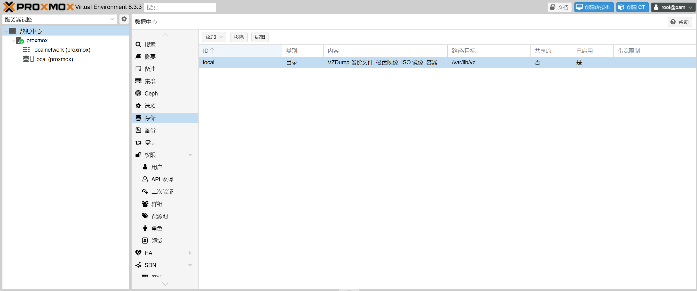

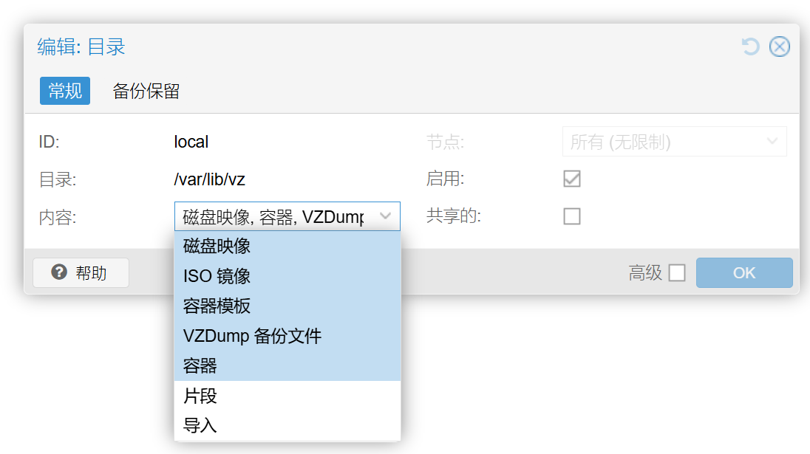

## 4.创建存储盘

选择主机，磁盘，目录

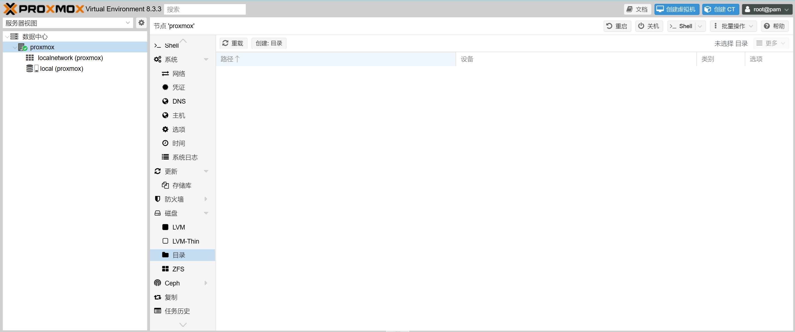

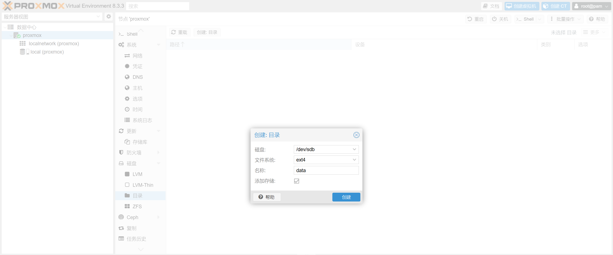

按照上述步骤添加硬盘

这样就按照好了

最后附上一张图

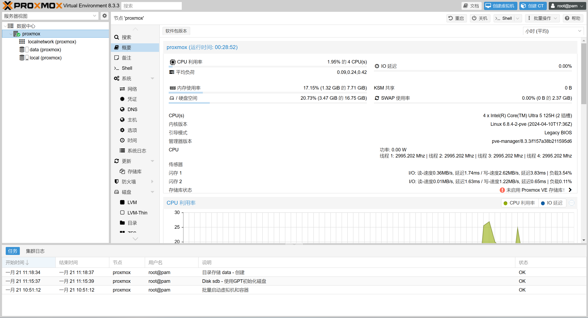